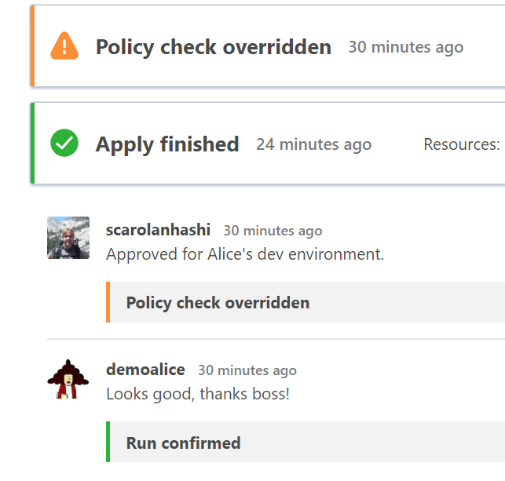

# Terraform Enterprise Sentinel Policy Enforcement Demo

This brief demo shows how Sentinel policy can enforce organizational standards and security rules when building infrastructure with Terraform Enterprise.

Slide content: Use Slides #38 - 40 of the Terraform Enterprise tech deck from the sales portal:
[Terraform Tech Deck](https://docs.google.com/presentation/d/1crMVSd4dXkrrCd1dv2M-lJ-l4yKCTWbN7ssfjGPqn5U/edit#slide=id.g48a3a9199a_9_18326)

## The Challenge
Organizations want the speed and flexibility of cloud, but struggle to enforce good security practices and prevent overprovisioning.

## Why should the prospect care?
Building in the cloud is appealing because it's fast and easy. If you are not careful, it's easy to run up a huge bill for unmanaged and abandoned resources. This is akin to leaving the water running or the lights on when no one is in the room. You're wasting money on resources that aren't being used. This can result in **overspending**. Also, granting unrestricted access to cloud APIs and GUI controls means extra risk. Users put the **organization at risk** when they build infrastructure that does not comply with security policy.

## What are the HashiCorp differentiators?
There is no other tool on the market that can do what Sentinel does today. Users would have to write their own tool from scratch to compare with the feature set offered by Sentinel. Sentinel operates on the premise that "an ounce of prevention is worth a pound of cure." because it prevents users from building non-compliant infrastructure _before_ it is actually created. Other tools on the market scan scan your cloud account for vulnerabilities, but only Sentinel can prevent the bad behavior before it happens.

## Setup & Demo
1. Have a Terraform Enterprise account. If you don't have an account yet you can sign up for one here:  
https://app.terraform.io/account/new
1. If you already have a TFE demo that stands up cloud infrastructure, you can use your sentinel policy with that. If not you're welcome to use one of these Terraform demos instead:  
AWS - Spacely Space Sprockets  
https://github.com/scarolan/spacelyspacesprockets/tree/master/aws/terraform_demo  
Azure - Terraform/Vault workshop (use the 'completed' branch)  
https://github.com/scarolan/azure-terraform-vault-workshop
1. Head over to the governance section of the terraform-guides repository:
https://github.com/hashicorp/terraform-guides/tree/master/governance
1. Find a Sentinel policy or two that match with what you'd like to demo. I like to put a handful of these into my organization so that I can show off controls for different clouds. In this example I'm using the `block-allow-all-cidr` and `restrict-vm-size` policies for Azure. These allow you to hit on two of the value propositions mentioned above, namely controlling costs and improving security.
1. Copy the policies into your organization Sentinel policy settings. Set them to 'soft-mandatory' fail. You may apply these policies to your entire organization, or create a policy set to tie them to your specific demo workspace.
1. Create another TFE user, you can call them Alice or Bob or whatever. Here's a trick you can use to sign up for Terraform with multiple email addresses. Simply add a +whatever to the end of your email username. Example: yourname+alice@hashicorp.com will still go to your inbox, but it is treated by TFE as a separate user. This allows you to create extra users that you can use for your demos. This little trick only works with Gmail and Google Apps email accounts.
1. Create a 'devs' team in your organization teams settings.
1. Grant the devs 'write' access to the workspace. This allows them to trigger runs, but not to override soft sentinel policy failures.
1. Log onto your normal browser window as an admin (yourself), and a second incognito browser or different browser as your dev user.
1. Trigger a run using the default settings and variables. See the sentinel failure. Point out how Alice needs an admin to come override this for her.
1. As yourself, navigate to the terraform run and hit the override button.
1. Back on Alice's browser, show that the run continues and she is now able to hit the apply button.
1. For bonus points, upload some fun avatars to Gravatar. You can create a persona for each email address you created in the previous step.